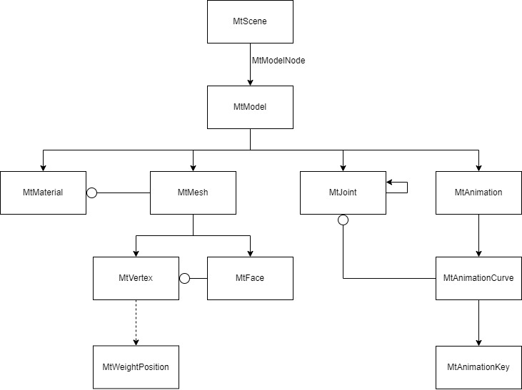

# ModelingToolkit.Core

A library to work with 3D models.

## Packages

| Package | Description |
| - | :- |
| [ModelingToolkit](https://github.com/osdanova/ModelingToolkit) | A tool to process and display 3D models |
| [ModelingToolkit.Formats](https://github.com/osdanova/ModelingToolkit.Formats) | An extension of core that supports importing and exporting using other formats |
| [ModelingToolkit.Core](https://github.com/osdanova/ModelingToolkit.Core) | The very basic platform agnostic objects to work with 3D models |

## Dependencies

* None

## Usage

Modeling Toolkit uses Gltf's coordinate system:

The following diagram reflects the basic structure of the library.

Lines with an arrow represent a hierarchy relationship.

Lines with a circle represent a pointing relationship.

Dashed lines represent am optional relationship.

Note that most classes have a Metadata property (Dictionary<string, string>) that can be used to store additional data.